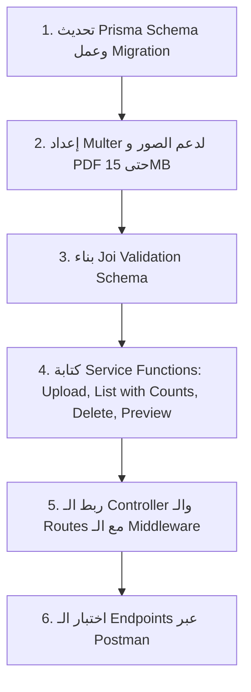

# 🎓 وثيقة التطوير الفني: إدارة المستندات والشهادات المهنية للمعلم
## (Teacher Professional Documents & Certificates Module)

---

## 📑 الفهرس (Table of Contents)
1. [نظرة عامة وتحليل الشاشات (UI Screens Analysis)](#1-نظرة-عامة-وتحليل-الشاشات)
2. [هيكلة التفكير البرمجي وخطة العمل (Execution Roadmap)](#2-هيكلة-التفكير-البرمجي-وخطة-العمل)
3. [تصميم قاعدة البيانات (Database & Prisma Schema)](#3-تصميم-قاعدة-البيانات-prisma-schema)
4. [مواصفات الـ Endpoints والـ APIs بالتفصيل](#4-مواصفات-الـ-endpoints-والـ-apis-بالتفصيل)
5. [هيكلة المجلدات المقترحة (Folder Structure)](#5-هيكلة-المجلدات-المقترحة)
6. [التنفيذ البرمجي الكامل (Implementation Code)](#6-التنفيذ-البرمجي-الكامل)
   - [إعداد رفع الملفات (Multer)](#أ-إعداد-رفع-الملفات-multer)
   - [طبقة التحقق (Validation Joi)](#ب-طبقة-التحقق-validation-joi)
   - [طبقة الـ Service](#ج-طبقة-الـ-service)
   - [طبقة الـ Controller](#د-طبقة-الـ-controller)
   - [طبقة الـ Routes](#هـ-طبقة-الـ-routes)
7. [معالجة الأخطاء وحالات الحافة (Edge Cases & Best Practices)](#7-معالجة-الأخطاء-وحالات-الحافة)

---

## 1. نظرة عامة وتحليل الشاشات

بناءً على التصميمات المرفقة:

### 🖼️ الشاشة الأولى: قائمة المستندات والشهادات (Main Certificates Screen)
- **شريط التبويبات (Tabs with Counters):**
  - شهادات التخصص (الأكاديمية) مع عداد، مثال: `(2)`
  - الدورات التدريبية مع عداد، مثال: `(2)`
  - شهادات الخبرة / أخرى مع عداد، مثال: `(1)`
- **كارت إضافة مستند (Upload Action Button):** زر يفتح Bottom Sheet لرفع مستند جديد.
- **كروت الشهادات (Certificate Cards):**
  - **شارة الحالة (Status Badge):** "موثق ومفعل" (`VERIFIED`) أو "قيد المراجعة" (`PENDING`).
  - **العنوان الرئيسي (Title):** مثال `B.Sc. in Physics & Quantum Mechanics`.
  - **الجهة المانحة (Issuer):** مثال `Faculty of Science, Cairo University`.
  - **بيانات الملف والسنة:** حجم الملف وسنة الإصدار، مثال `MB 3.2 • 2019`.
  - **أيقونة نوع الملف:** أيقونة PDF أو صورة.
  - **أزرار التحكم:**
    - `معاينة المستند`: لفتح شاشة المعاينة.
    - `حذف`: لحذف الشهادة مع تأكيد الحذف.

### 🖼️ الشاشة الثانية: نافذة رفع مستند جديد (Upload New Document Modal)
- **نوع المستند (Dropdown):** (شهادة تخصص / دورة تدريبية / شهادة خبرة).
- **عنوان الشهادة / الدورة (Input Text):** مثال: `بكالوريوس علوم فيزياء`.
- **الجهة المانحة / الجامعة (Input Text):** مثال: `جامعة القاهرة`.
- **سنة الإصدار (Year Input):** مثال: `2023`.
- **منطقة رفع الملف (File Picker):** تدعم ملفات PDF وصور حتى **15 ميجابايت**.
- **زر الإرسال:** `رفع مستند جديد`.

### 🖼️ الشاشة الثالثة: معاينة المستند (Document Preview Modal)
- عرض ملف الـ PDF أو الصورة بشكل كامل.
- عرض العنوان والجهة وسنة التخرج/الإصدار وزر إغلاق `X`.

---

## 2. هيكلة التفكير البرمجي وخطة العمل



---

## 3. تصميم قاعدة البيانات (Prisma Schema)

قم بتحديث الموديل في ملف `prisma/schema/user.prisma` (أو `teacher.prisma`):

```prisma
enum CertificateType {
  ACADEMIC      // شهادة التخصص
  COURSE        // الدورات التدريبية
  EXPERIENCE    // شهادات الخبرة
  OTHER         // شهادات أخرى
}

enum CertificateStatus {
  PENDING       // قيد المراجعة
  VERIFIED      // موثق ومفعل
  REJECTED      // مرفوض
}

model TeacherCertificate {
  id              String            @id @default(uuid())
  teacherId       String
  teacher         Teacher           @relation(fields: [teacherId], references: [id], onDelete: Cascade)

  type            CertificateType   @default(ACADEMIC)
  title           String            // عنوان الشهادة / الدورة
  issuer          String            // الجهة المانحة / الجامعة
  issueYear       Int               // سنة الإصدار (مثال: 2019)
  
  fileUrl         String            // مسار تخزين الملف
  fileType        String            // "PDF" | "IMAGE"
  fileSize        String?           // حجم الملف المنسق (مثال: "3.2 MB")
  
  status          CertificateStatus @default(PENDING)
  rejectionReason String?           @db.Text

  createdAt       DateTime          @default(now())
  updatedAt       DateTime          @updatedAt

  @@index([teacherId])
  @@index([type])
  @@index([status])
  @@map("teacher_certificates")
}
```

> **لتطبيق التغييرات على قاعدة البيانات:**
> ```bash
> npx prisma migrate dev --name update_teacher_certificates_schema
> npx prisma generate
> ```

---

## 4. مواصفات الـ Endpoints والـ APIs بالتفصيل

### 🔹 1. رفع شهادة / مستند جديد
- **Method:** `POST`
- **Route:** `/api/v1/teacher/certificates`
- **Auth:** Bearer Token (Teacher Role)
- **Headers:** `Content-Type: multipart/form-data`
- **Body (form-data):**
  | Key | Type | Description | Required |
  | :--- | :--- | :--- | :--- |
  | `type` | String | `ACADEMIC`, `COURSE`, `EXPERIENCE`, `OTHER` | نعم |
  | `title` | String | عنوان الشهادة (مثال: بكالوريوس فيزياء) | نعم |
  | `issuer` | String | الجهة المانحة (مثال: جامعة القاهرة) | نعم |
  | `issueYear` | Number | سنة الإصدار (مثال: 2019) | نعم |
  | `file` | File | ملف PDF أو صورة (الحد الأقصى 15MB) | نعم |

- **Response (201 Created):**
```json
{
  "status": 201,
  "success": true,
  "message": "Certificate uploaded successfully",
  "data": {
    "id": "c1f7b8a2-9e3d-4c5b-8a1a-7e9b2c3d4e5f",
    "type": "ACADEMIC",
    "title": "B.Sc. in Physics & Quantum Mechanics",
    "issuer": "Faculty of Science, Cairo University",
    "issueYear": 2019,
    "fileUrl": "uploads/teachers/certificates/user-uuid/1727430000-cert.pdf",
    "fileType": "PDF",
    "fileSize": "3.2 MB",
    "status": "PENDING",
    "createdAt": "2026-09-27T08:30:00.000Z"
  }
}
```

---

### 🔹 2. جلب قائمة الشهادات مع العدادات للتبويبات
- **Method:** `GET`
- **Route:** `/api/v1/teacher/certificates`
- **Query Params (اختياري):**
  - `?type=ACADEMIC` (للفلترة حسب التبويب المختار)
- **Auth:** Bearer Token (Teacher Role)

- **Response (200 OK):**
```json
{
  "status": 200,
  "success": true,
  "data": {
    "counts": {
      "all": 5,
      "academic": 2,
      "course": 2,
      "experience": 1,
      "other": 0
    },
    "certificates": [
      {
        "id": "c1f7b8a2-9e3d-4c5b-8a1a-7e9b2c3d4e5f",
        "type": "ACADEMIC",
        "title": "B.Sc. in Physics & Quantum Mechanics",
        "issuer": "Faculty of Science, Cairo University",
        "issueYear": 2019,
        "fileUrl": "uploads/teachers/certificates/user-uuid/1727430000-cert.pdf",
        "fileType": "PDF",
        "fileSize": "3.2 MB",
        "status": "VERIFIED"
      },
      {
        "id": "d2a8c9b3-0f4e-5d6c-9b2b-8f0c3d4e5f6a",
        "type": "ACADEMIC",
        "title": "Master of Education",
        "issuer": "Ain Shams University",
        "issueYear": 2022,
        "fileUrl": "uploads/teachers/certificates/user-uuid/1727430050-master.pdf",
        "fileType": "PDF",
        "fileSize": "4.1 MB",
        "status": "VERIFIED"
      }
    ]
  }
}
```

---

### 🔹 3. جلب تفاصيل شهادة واحدة (للمعاينة)
- **Method:** `GET`
- **Route:** `/api/v1/teacher/certificates/:id`
- **Auth:** Bearer Token (Teacher Role)

- **Response (200 OK):**
```json
{
  "status": 200,
  "success": true,
  "data": {
    "id": "c1f7b8a2-9e3d-4c5b-8a1a-7e9b2c3d4e5f",
    "type": "ACADEMIC",
    "title": "B.Sc. in Physics & Quantum Mechanics",
    "issuer": "Faculty of Science, Cairo University",
    "issueYear": 2019,
    "fileUrl": "uploads/teachers/certificates/user-uuid/1727430000-cert.pdf",
    "fileType": "PDF",
    "fileSize": "3.2 MB",
    "status": "VERIFIED",
    "createdAt": "2026-09-27T08:30:00.000Z"
  }
}
```

---

### 🔹 4. حذف شهادة
- **Method:** `DELETE`
- **Route:** `/api/v1/teacher/certificates/:id`
- **Auth:** Bearer Token (Teacher Role)

- **Response (200 OK):**
```json
{
  "status": 200,
  "success": true,
  "message": "Certificate deleted successfully"
}
```

---

## 5. هيكلة المجلدات المقترحة

```
src/
 └── modules/
      └── teacher/
           ├── certificates/                  <-- الموديول الجديد
           │    ├── certificate.controller.js
           │    ├── certificate.routes.js
           │    ├── certificate.service.js
           │    └── certificate.validation.js
           ├── profile/
           ├── courses/
           └── auth/
```

---

## 6. التنفيذ البرمجي الكامل

### أ. إعداد رفع الملفات (Multer Middleware)
في مسار الـ Routes، يتم تخصيص الرفع ليشمل الصور والـ PDF حتى 15MB:

```javascript
// يُستخدم مباشرة في certificate.routes.js
import { localFileUpload } from "../../../utils/multer/local.multer.js";
import { fileValidation } from "../../../utils/multer/fileValidation.js";

const certificateUpload = localFileUpload({
  customPath: (req) => `teacher/certificates/${req.user.id}`,
  validation: [
    ...fileValidation.image,
    ...fileValidation.document.filter((type) => type === "application/pdf"),
  ],
  maxSizeInMB: 15,
}).single("file");
```

---

### ب. طبقة التحقق (Validation Joi)
**`src/modules/teacher/certificates/certificate.validation.js`:**

```javascript
import joi from "joi";
import { generalFields } from "../../../utils/validation/generalField.js";

export const createCertificate = {
  body: joi
    .object({
      type: joi.string().valid("ACADEMIC", "COURSE", "EXPERIENCE", "OTHER").required(),
      title: joi.string().min(2).max(150).trim().required(),
      issuer: joi.string().min(2).max(150).trim().required(),
      issueYear: joi
        .number()
        .integer()
        .min(1950)
        .max(new Date().getFullYear())
        .required(),
    })
    .options({ allowUnknown: false }),
};

export const getCertificatesQuery = {
  query: joi
    .object({
      type: joi.string().valid("ACADEMIC", "COURSE", "EXPERIENCE", "OTHER").optional(),
    })
    .options({ allowUnknown: false }),
};

export const certificateIdParam = {
  params: joi
    .object({
      id: generalFields.id.required(),
    })
    .options({ allowUnknown: false }),
};
```

---

### ج. طبقة الـ Service
**`src/modules/teacher/certificates/certificate.service.js`:**

```javascript
import * as db from "../../../db/db.service.js";
import { deleteFile } from "../../../utils/multer/file.utils.js";

/**
 * دالة مساعدة لتنسيق حجم الملف
 */
const formatBytes = (bytes) => {
  if (!bytes) return null;
  const mb = bytes / (1024 * 1024);
  return `${mb.toFixed(1)} MB`;
};

/**
 * 1. رفع وحفظ شهادة جديدة
 */
export const createCertificateService = async ({ userId, body, file }) => {
  if (!file) {
    const error = new Error("FILE_IS_REQUIRED");
    error.cause = 400;
    throw error;
  }

  const teacher = await db.findFirst({
    model: "teacher",
    where: { userId },
  });

  if (!teacher) {
    // تنظيف الملف المرفوع إذا لم يتم العثور على المعلم
    if (file.relativeDestination) deleteFile(file.relativeDestination);
    const error = new Error("TEACHER_NOT_FOUND");
    error.cause = 404;
    throw error;
  }

  const fileType = file.mimetype === "application/pdf" ? "PDF" : "IMAGE";
  const fileSize = formatBytes(file.size);

  try {
    const certificate = await db.create({
      model: "teacherCertificate",
      data: {
        teacherId: teacher.id,
        type: body.type,
        title: body.title,
        issuer: body.issuer,
        issueYear: Number(body.issueYear),
        fileUrl: file.relativeDestination,
        fileType,
        fileSize,
        status: "PENDING",
      },
    });

    return certificate;
  } catch (err) {
    if (file.relativeDestination) deleteFile(file.relativeDestination);
    throw err;
  }
};

/**
 * 2. جلب جميع الشهادات مع عدادات التبويبات
 */
export const getCertificatesService = async ({ userId, typeFilter }) => {
  const teacher = await db.findFirst({
    model: "teacher",
    where: { userId },
  });

  if (!teacher) {
    const error = new Error("TEACHER_NOT_FOUND");
    error.cause = 404;
    throw error;
  }

  // جلب كافة الشهادات لحساب العدادات
  const allCertificates = await db.findMany({
    model: "teacherCertificate",
    where: { teacherId: teacher.id },
    orderBy: { createdAt: "desc" },
  });

  const counts = {
    all: allCertificates.length,
    academic: allCertificates.filter((c) => c.type === "ACADEMIC").length,
    course: allCertificates.filter((c) => c.type === "COURSE").length,
    experience: allCertificates.filter((c) => c.type === "EXPERIENCE").length,
    other: allCertificates.filter((c) => c.type === "OTHER").length,
  };

  const certificates = typeFilter
    ? allCertificates.filter((c) => c.type === typeFilter)
    : allCertificates;

  return { counts, certificates };
};

/**
 * 3. جلب شهادة واحدة للمعاينة
 */
export const getCertificateByIdService = async ({ userId, certificateId }) => {
  const teacher = await db.findFirst({
    model: "teacher",
    where: { userId },
  });

  if (!teacher) {
    const error = new Error("TEACHER_NOT_FOUND");
    error.cause = 404;
    throw error;
  }

  const certificate = await db.findFirst({
    model: "teacherCertificate",
    where: {
      id: certificateId,
      teacherId: teacher.id,
    },
  });

  if (!certificate) {
    const error = new Error("CERTIFICATE_NOT_FOUND");
    error.cause = 404;
    throw error;
  }

  return certificate;
};

/**
 * 4. حذف شهادة
 */
export const deleteCertificateService = async ({ userId, certificateId }) => {
  const teacher = await db.findFirst({
    model: "teacher",
    where: { userId },
  });

  if (!teacher) {
    const error = new Error("TEACHER_NOT_FOUND");
    error.cause = 404;
    throw error;
  }

  const certificate = await db.findFirst({
    model: "teacherCertificate",
    where: {
      id: certificateId,
      teacherId: teacher.id,
    },
  });

  if (!certificate) {
    const error = new Error("CERTIFICATE_NOT_FOUND");
    error.cause = 404;
    throw error;
  }

  // 1. حذف الملف الفعلي من السيرفر
  if (certificate.fileUrl) {
    deleteFile(certificate.fileUrl);
  }

  // 2. حذف السجل من قاعدة البيانات
  await db.deleteOne({
    model: "teacherCertificate",
    where: { id: certificate.id },
  });

  return {};
};
```

---

### د. طبقة الـ Controller
**`src/modules/teacher/certificates/certificate.controller.js`:**

```javascript
import * as certService from "./certificate.service.js";
import { asyncHandler, successResponse } from "../../../utils/response.js";

export const createCertificate = asyncHandler(async (req, res) => {
  const certificate = await certService.createCertificateService({
    userId: req.user.id,
    body: req.body,
    file: req.file,
  });

  return successResponse({
    res,
    status: 201,
    message: "Certificate uploaded successfully",
    data: certificate,
  });
});

export const getCertificates = asyncHandler(async (req, res) => {
  const result = await certService.getCertificatesService({
    userId: req.user.id,
    typeFilter: req.query?.type,
  });

  return successResponse({
    res,
    data: result,
  });
});

export const getCertificateById = asyncHandler(async (req, res) => {
  const certificate = await certService.getCertificateByIdService({
    userId: req.user.id,
    certificateId: req.params.id,
  });

  return successResponse({
    res,
    data: certificate,
  });
});

export const deleteCertificate = asyncHandler(async (req, res) => {
  await certService.deleteCertificateService({
    userId: req.user.id,
    certificateId: req.params.id,
  });

  return successResponse({
    res,
    message: "Certificate deleted successfully",
    data: {},
  });
});
```

---

### هـ. طبقة الـ Routes
**`src/modules/teacher/certificates/certificate.routes.js`:**

```javascript
import { Router } from "express";
import * as certController from "./certificate.controller.js";
import * as certValidation from "./certificate.validation.js";
import { authentication } from "../../../middleware/authentication.middleware.js";
import { authorizeResource } from "../../../middleware/authorization.middleware.js";
import { validation } from "../../../middleware/validation.middleware.js";
import { localFileUpload } from "../../../utils/multer/local.multer.js";
import { fileValidation } from "../../../utils/multer/fileValidation.js";

const router = Router();

const certificateUpload = localFileUpload({
  customPath: (req) => `teacher/certificates/${req.user.id}`,
  validation: [
    ...fileValidation.image,
    ...fileValidation.document.filter((type) => type === "application/pdf"),
  ],
  maxSizeInMB: 15,
});

router.use(authentication(), authorizeResource("teachers"));

router
  .route("/")
  .post(
    certificateUpload.single("file"),
    validation(certValidation.createCertificate),
    certController.createCertificate
  )
  .get(
    validation(certValidation.getCertificatesQuery),
    certController.getCertificates
  );

router
  .route("/:id")
  .get(
    validation(certValidation.certificateIdParam),
    certController.getCertificateById
  )
  .delete(
    validation(certValidation.certificateIdParam),
    certController.deleteCertificate
  );

export default router;
```

---

## 7. معالجة الأخطاء وحالات الحافة (Edge Cases & Best Practices)

1. **حماية ملكية المستند (Data Ownership & Security):**
   - التحقق دائماً من `teacherId: teacher.id` عند البحث أو الحذف حتى لا يتمكن مستخدم من حذف شهادات غيره بالتخمين لمعرف `id`.
2. **تنظيف الملفات اليتيمة (Orphan Files Cleanup):**
   - في حالة حدوث أي استثناء أثناء الحفظ في الـ DB يتم فوراً استدعاء `deleteFile(file.relativeDestination)` حتى لا تمتلئ مساحة السيرفر بملفات لا سجل لها.
3. **حساب الحجم التلقائي (Automatic File Size):**
   - يتم تخزين الحجم كنص منسق (مثل `3.2 MB`) لتسهيل عرضه مباشرة في واجهة المستخدم دون الحاجة لحسابات إضافية في الـ Frontend.
4. **تأكيد الـ Mime Types:**
   - السماح فقط بـ `PDF` وأنواع الصور القياسية (`JPEG`, `PNG`, `WEBP`) مع رفض أي صيغ أخرى برسالة واضحة `INVALID_FILE_FORMAT`.

---
*تم إنشاء هذا الدليل ليكون مرجعاً برمجياً شاملاً ومباشراً للبدء والتنفيذ فوراً.*
