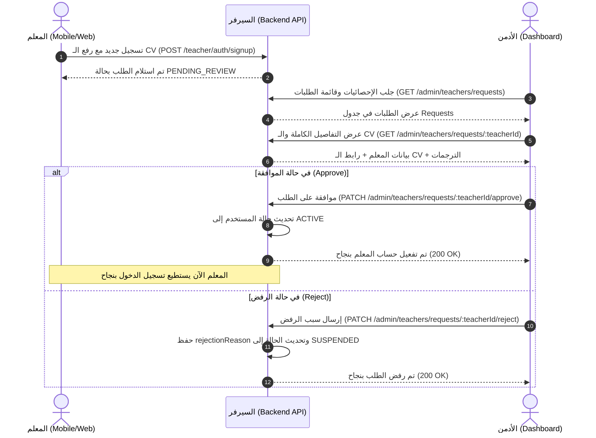

# 🎓 دليل وتوثيق نظام مراجعة واعتماد المعلمين (Teacher Approval System)
> **LearnX LMS Backend — Admin Review & Approval Module Documentation**

---

## 📌 1. دورة حياة طلب المعلم (Flow Overview)



---

## 🛠️ 2. تفاصيل الـ Endpoints والـ Validation والـ Data المرسلة

---

### 1️⃣ إحصائيات الطلبات العلوية (Stats Cards)
* **المسار (URL):** `GET /api/v1/admin/teachers/requests/stats`
* **الـ Headers:**
  - `Authorization`: `Bearer <ADMIN_ACCESS_TOKEN>`
  - `Accept-Language`: `ar` (أو `en`)
* **الـ Params / Body:** لا يوجد.
* **الـ Joi Validation:**
  ```javascript
  export const getTeacherRequestsStats = {}; // لا يتطلب مدخلات
  ```
* **الاستجابة (Response 200 OK):**
  ```json
  {
    "status": 200,
    "message": "تمت العملية بنجاح.",
    "data": {
      "total": 8,
      "pending": 4,
      "approved": 4,
      "rejected": 0
    }
  }
  ```

---

### 2️⃣ جدول الطلبات مع الفلترة والبحث (Requests Table)
* **المسار (URL):** `GET /api/v1/admin/teachers/requests`
* **الـ Headers:**
  - `Authorization`: `Bearer <ADMIN_ACCESS_TOKEN>`
* **الـ Query Parameters المتاحة:**
  - `page` (number, default: 1): رقم الصفحة
  - `limit` (number, default: 10): عدد العناصر في الصفحة
  - `status` (string, optional): `PENDING_REVIEW` | `ACTIVE` | `SUSPENDED`
  - `search` (string, optional): بحث بالاسم أو البريد الإلكتروني أو الهاتف
* **الـ Joi Validation:**
  ```javascript
  export const getTeacherRequests = {
    query: joi.object({
      page: joi.number().integer().min(1).default(1),
      limit: joi.number().integer().min(1).max(100).default(10),
      status: joi.string().valid("PENDING_REVIEW", "ACTIVE", "SUSPENDED", "BLOCKED").optional(),
      search: joi.string().trim().allow("").optional(),
    }).options({ allowUnknown: false }),
  };
  ```
* **الاستجابة (Response 200 OK):**
  ```json
  {
    "status": 200,
    "message": "تمت العملية بنجاح.",
    "data": {
      "requests": [
        {
          "requestId": "REQ-0001",
          "teacherId": "c7a8b9e0-8b1e-4c7b-9e0a-1b2c3d4e5f6a",
          "user": {
            "id": "e1f2a3b4-5c6d-7e8f-9a0b-1c2d3e4f5a6b",
            "name": "Sarah Johnson",
            "email": "sarah@example.com",
            "phone": "01012345678",
            "profilePhoto": null
          },
          "type": "Become Instructor",
          "priority": "High",
          "status": "Pending",
          "createdAt": "2026-09-23T11:28:00.000Z"
        }
      ],
      "pagination": {
        "page": 1,
        "limit": 10,
        "totalItems": 4,
        "totalPages": 1,
        "hasNextPage": false
      }
    }
  }
  ```

---

### 3️⃣ تفاصيل الطلب لمودال المعاينة (Request Details Modal)
* **المسار (URL):** `GET /api/v1/admin/teachers/requests/:teacherId`
* **الـ Headers:**
  - `Authorization`: `Bearer <ADMIN_ACCESS_TOKEN>`
* **الـ Params:**
  - `teacherId`: معرف المعلم (UUID)
* **الـ Joi Validation:**
  ```javascript
  export const getTeacherRequestDetails = {
    params: joi.object({
      teacherId: generalFields.id.required(),
    }).required().options({ allowUnknown: false }),
  };
  ```
* **الاستجابة (Response 200 OK):**
  ```json
  {
    "status": 200,
    "message": "تمت العملية بنجاح.",
    "data": {
      "teacher": {
        "requestId": "REQ-0001",
        "teacherId": "c7a8b9e0-...",
        "experienceYears": 5,
        "cvUrl": "uploads/teachers/cv/1742798932-abc123.pdf",
        "linkedinUrl": "https://linkedin.com/in/sarah",
        "user": {
          "id": "e1f2a3b4-...",
          "firstName": "Sarah",
          "lastName": "Johnson",
          "email": "sarah@example.com",
          "phone": "01012345678",
          "status": "PENDING_REVIEW",
          "createdAt": "2026-09-23T11:28:00.000Z"
        },
        "translations": [
          {
            "locale": "ar",
            "subject": "اللغة الإنجليزية",
            "headline": "معلم محادثة معتمد وخبرة 5 سنوات",
            "bio": "نبذة عن خبرتي وطريقتي في تدريس اللغة الإنجليزية..."
          }
        ]
      }
    }
  }
  ```

---

### 4️⃣ الموافقة على المعلم (Approve Teacher) 🌟 [شرح تفصيلي]

#### 🔹 طريقة استدعاء الـ API في Postman / Frontend:
* **الـ Method:** `PATCH`
* **المسار (URL):** `http://localhost:3000/api/v1/admin/teachers/requests/:teacherId/approve`
* **الـ Headers:**
  ```http
  Authorization: Bearer <ADMIN_ACCESS_TOKEN>
  Accept-Language: ar
  Content-Type: application/json
  ```
* **الـ Params:**
  - `teacherId`: الـ UUID الخاص بالمعلم (مثال: `c7a8b9e0-8b1e-4c7b-9e0a-1b2c3d4e5f6a`)
* **الـ Body:**
  - **فارغ تماماً `{}`** (لأن العملية لا تحتاج أي بيانات إضافية سوى معرف المعلم في الـ URL).

#### 🔹 الـ Joi Validation الخاص بها:
```javascript
export const approveTeacherRequest = {
  params: joi
    .object({
      teacherId: generalFields.id.required(),
    })
    .required()
    .options({ allowUnknown: false }),
};
```

#### 🔹 ماذا يفعل السيرفر في الكواليس (Backend Logic):
1. يستقبل الـ `teacherId` من الرابط.
2. يبحث عن المعلم في جدول `Teacher` ليتأكد من وجوده، ويستخرج منه الـ `userId`.
3. يقوم بعمل `updateOne` لجدول **`User`** ويغير حالته:
   - `status`: **`ACTIVE`**
   - `confirmEmail`: `new Date()`
4. يقوم بمسح أي `rejectionReason` سابق من جدول `Teacher`.
5. يرجع استجابة نجاح `200 OK`.
6. **النتيجة:** المعلم أصبح نشطاً ويستطيع الآن تسجيل الدخول فوراً عبر تطبيق المعلم!

#### 🔹 الاستجابة الناتجة (Response 200 OK):
```json
{
  "message": "تمت الموافقة على المعلم وتفعيل حسابه بنجاح.",
  "data": {
    "teacherId": "c7a8b9e0-8b1e-4c7b-9e0a-1b2c3d4e5f6a",
    "status": "ACTIVE",
    "email": "sarah@example.com"
  }
}
```

---

### 5️⃣ رفض طلب المعلم (Reject Teacher)

#### 🔹 طريقة استدعاء الـ API:
* **الـ Method:** `PATCH`
* **المسار (URL):** `http://localhost:3000/api/v1/admin/teachers/requests/:teacherId/reject`
* **الـ Headers:**
  ```http
  Authorization: Bearer <ADMIN_ACCESS_TOKEN>
  Content-Type: application/json
  ```
* **الـ Params:**
  - `teacherId`: الـ UUID الخاص بالمعلم
* **الـ Request Body (JSON):**
  ```json
  {
    "reason": "السيرة الذاتية غير واضحة وتنقصه شهادات الخبرة المطلوبة."
  }
  ```

#### 🔹 الـ Joi Validation:
```javascript
export const rejectTeacherRequest = {
  params: joi
    .object({
      teacherId: generalFields.id.required(),
    })
    .required()
    .options({ allowUnknown: false }),

  body: joi
    .object({
      reason: joi.string().min(5).max(1000).trim().required(),
    })
    .required()
    .options({ allowUnknown: false }),
};
```

#### 🔹 ماذا يفعل السيرفر في الكواليس:
1. يغير حالة الـ `User` إلى **`SUSPENDED`**.
2. يحفظ نص الـ `reason` في حقل `rejectionReason` بجدول `Teacher`.
3. يرجع استجابة `200 OK`.

#### 🔹 الاستجابة الناتجة (Response 200 OK):
```json
{
  "message": "تم رفض طلب المعلم بنجاح.",
  "data": {
    "teacherId": "c7a8b9e0-...",
    "status": "SUSPENDED",
    "rejectionReason": "السيرة الذاتية غير واضحة وتنقصه شهادات الخبرة المطلوبة."
  }
}
```
