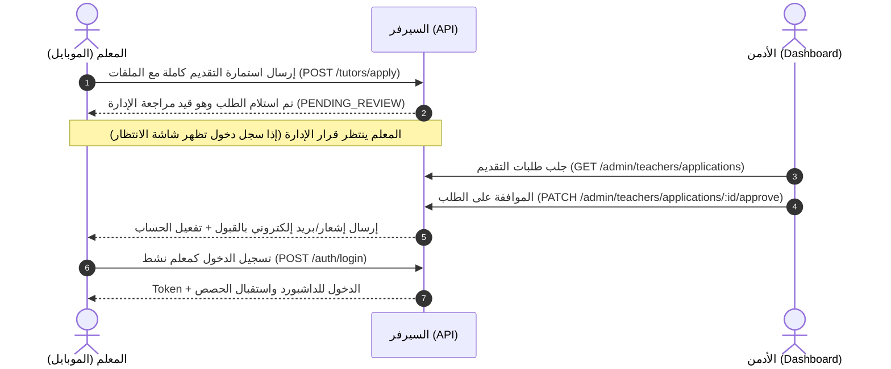
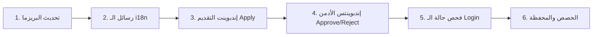

# 🎓 دليل وتوثيق نظام المعلم الشامل (المبسّط) — Tutor & Teacher Module
> **LearnX LMS Backend Architecture & Implementation Guide (Single Endpoint Flow)**

---

## 📑 الفهرس
1. [الفلسفة ودورة حياة المعلم (The Big Picture)](#1-الفلسفة-ودورة-حياة-المعلم)
2. [كيف يعمل تقديم المعلم بطلب واحد (Single Endpoint Flow للموبايل)](#2-كيف-يعمل-تقديم-المعلم-بطلب-واحد)
3. [نظام الترجمة والتدويل (Localization & i18n)](#3-نظام-الترجمة-والتدويل)
4. [هيكلية قاعدة البيانات (Prisma Schema Models)](#4-هيكلية-قاعدة-البيانات)
5. [هيكل المجلدات المبسّط (Clean Folder Structure)](#5-هيكل-المجلدات-المبسط)
6. [دليل الـ Endpoints الكامل والشامل](#6-دليل-الـ-endpoints-الكامل)
   - [أ) تقديم وتسجيل المعلم (Tutor Application)](#أ-تقديم-وتسجيل-المعلم-tutor-application)
   - [ب) مراجعة واعتماد الأدمن (Admin Review & Approval)](#ب-مراجعة-واعتماد-الأدمن-admin-approval)
   - [ج) ميزات تطبيق المعلم الأساسية (Core Tutor App)](#ج-ميزات-تطبيق-المعلم-الأساسية)
7. [خريطة التنفيذ السريعة والمباشرة (Execution Steps)](#7-خريطة-التنفيذ-السريعة-والمباشرة)

---

## 1. الفلسفة ودورة حياة المعلم

### ⚠️ الفرق الجوهري بين الطالب والمعلم:
* **الطالب (Student):** تسجيل حساب عادي ← تأكيد إيميل ← حسابه نشط فوراً `ACTIVE`.
* **المعلم (Tutor):** يملأ فورم التقديم ويرسله **في ريكويست واحد كامل** (`POST /api/v1/tutors/apply`) ← ينشأ الحساب بحالة **`PENDING_REVIEW`** مع بروفايل المعلم والشهادات ← **الأدمن يراجع الطلب من لوحة التحكم** ← عند موافقة الأدمن: يتحول حسابه لـ `ACTIVE` ويُمنح رول `TEACHER` ويستطيع تسجيل الدخول والعمل.



---

## 2. كيف يعمل تقديم المعلم بطلب واحد (Single Endpoint)

بدلاً من تقسيم الحفظ على 8 طلبات معقدة:
1. **الموبايل يجمع كل البيانات في شاشاته محلياً (In-Memory / Multi-Step UI Form)**.
2. عند الضغط على **"إرسال الطلب"** في آخر شاشة:
   - يرسل الموبايل **Request واحد فقط** من نوع `multipart/form-data` يحتوي على:
     - **بيانات المستخدم:** الاسم، البريد، كلمة السر، الهاتف، الدولة، الصورة الشخصية.
     - **بيانات التدريس:** المادة (Subject)، المسمى المهني (Headline)، سنوات الخبرة، النبذة (Bio)، اللغات.
     - **التسعير والتفرغ:** أسعار الحصص (25 دقيقة / 50 دقيقة)، جدول الأوقات الأسبوعي (JSON).
     - **المرفقات:** ملف الـ CV، صورة/ملف الشهادات، الفيديو التعريفي (أو رابطه).
3. **السيرفر (Backend Transaction):**
   - ينشئ المستخدم `User` بحالة `PENDING_REVIEW`.
   - ينشئ بروفايل المعلم `Teacher` ومعه سجلات الشهادات ومواعيد التفرغ دفعة واحدة.
   - يرجع استجابة موحدة ومترجمة: `"TUTOR_APPLICATION_SUBMITTED_SUCCESSFULLY"`.

---

## 3. نظام الترجمة والتدويل (Localization & i18n)

### أ) رسائل الخادم والتحقق (API Messages):
في `src/i18n/locales/ar/common.json` و `src/i18n/locales/en/common.json`:
```json
{
  "TUTOR_APPLICATION_SUBMITTED": "تم إرسال طلب التقديم بنجاح وهو قيد مراجعة الإدارة.",
  "ACCOUNT_UNDER_REVIEW": "حسابك قيد مراجعة الإدارة حالياً، سيتم إشعارك فور الاعتماد.",
  "ACCOUNT_REJECTED": "تم رفض طلب التقديم. السبب: {{reason}}",
  "TUTOR_APPROVED_SUCCESSFULLY": "تمت الموافقة على المعلم وتفعيل حسابه بنجاح.",
  "TUTOR_REJECTED_SUCCESSFULLY": "تم رفض طلب المعلم بنجاح."
}
```

### ب) محتوى قاعدة البيانات (Multilingual Content):
- اللغات التي يتحدث بها المعلم تخزن كـ `Json` منظم:
  `[{"code": "en", "level": "NATIVE"}, {"code": "ar", "level": "FLUENT"}]`
- التخصصات ومواد التدريس ترتبط بالتصنيفات متعددة اللغات `categories` المترجمة مسبقاً في قاعدة البيانات.

---

## 4. هيكلية قاعدة البيانات (Prisma Schema)

### 1. الـ Enums:
```prisma
enum TutorApplicationStatus {
  PENDING_REVIEW
  APPROVED
  REJECTED
}

enum BookingStatus {
  PENDING
  CONFIRMED
  CANCELLED
  IN_PROGRESS
  COMPLETED
}

enum PayoutStatus {
  PENDING
  PROCESSING
  COMPLETED
  REJECTED
}
```

### 2. جدول المعلم (`Teacher`):
```prisma
model Teacher {
  id                  String                 @id @default(uuid())
  userId              String                 @unique
  user                User                   @relation(fields: [userId], references: [id], onDelete: Cascade)
  
  // الملف المهني والتخصص
  headline            String?                // e.g. "معلم محادثة معتمد لجميع المستويات"
  subject             String                 // المادة الأساسية
  experienceYears     Int                    @default(0)
  bio                 String?                @db.Text
  languages           Json?                  // اللغات ومستوياتها
  timezone            String                 @default("UTC")
  
  // الميديا والملفات
  videoUrl            String?                // رابط الفيديو التعريفي
  cvUrl               String?                // رابط السيرة الذاتية
  
  // التسعير والتواجد
  hourlyRate25Min     Decimal?               @db.Decimal(10, 2)
  hourlyRate50Min     Decimal?               @db.Decimal(10, 2)
  currency            String                 @default("USD")
  isAvailable         Boolean                @default(true) // متاح للظهور والبحث
  
  // حالة طلب التقديم
  applicationStatus   TutorApplicationStatus @default(PENDING_REVIEW)
  rejectionReason     String?                @db.Text
  reviewedAt          DateTime?
  reviewedBy          String?                // معرف الأدمن
  
  // إحصائيات
  avgRating           Decimal                @default(0.0) @db.Decimal(3, 2)
  reviewsCount        Int                    @default(0)
  totalStudentsCount  Int                    @default(0)
  totalLessonsCount   Int                    @default(0)
  
  // العلاقات
  certificates        TutorCertificate[]
  availabilities      TutorAvailability[]
  bookings            Booking[]              @relation("TutorBookings")
  payoutRequests      PayoutRequest[]
  earningsLedger      TutorEarningsLedger[]
  lessonNotes         LessonNote[]
  
  createdAt           DateTime               @default(now())
  updatedAt           DateTime               @updatedAt

  @@index([userId])
  @@index([applicationStatus])
  @@map("teachers")
}
```

### 3. الجداول التابعة (الشهادات، التفرغ، الحصص، السحب):
```prisma
model TutorCertificate {
  id          String   @id @default(uuid())
  teacherId   String
  teacher     Teacher  @relation(fields: [teacherId], references: [id], onDelete: Cascade)
  title       String   // اسم الشهادة
  issuer      String?  // الجهة المانحة
  fileUrl     String   // رابط صورة أو PDF الشهادة
  createdAt   DateTime @default(now())

  @@map("tutor_certificates")
}

model TutorAvailability {
  id          String   @id @default(uuid())
  teacherId   String
  teacher     Teacher  @relation(fields: [teacherId], references: [id], onDelete: Cascade)
  dayOfWeek   Int      // 0 = Sunday, 1 = Monday ... 6 = Saturday
  startTime   String   // "09:00"
  endTime     String   // "17:00"
  isActive    Boolean  @default(true)

  @@map("tutor_availabilities")
}

model Booking {
  id                  String         @id @default(uuid())
  studentId           String
  student             User           @relation("StudentBookings", fields: [studentId], references: [id], onDelete: Cascade)
  teacherId           String
  teacher             Teacher        @relation("TutorBookings", fields: [teacherId], references: [id], onDelete: Cascade)
  
  scheduledAt         DateTime
  durationMinutes     Int            @default(50)
  status              BookingStatus  @default(PENDING)
  price               Decimal        @db.Decimal(10, 2)
  currency            String         @default("USD")
  
  agoraChannelName    String?
  agoraToken          String?
  meetingLink         String?
  
  lessonNote          LessonNote?
  
  createdAt           DateTime       @default(now())
  updatedAt           DateTime       @updatedAt

  @@index([studentId])
  @@index([teacherId])
  @@index([status])
  @@map("bookings")
}

model LessonNote {
  id              String   @id @default(uuid())
  bookingId       String   @unique
  booking         Booking  @relation(fields: [bookingId], references: [id], onDelete: Cascade)
  teacherId       String
  teacher         Teacher  @relation(fields: [teacherId], references: [id], onDelete: Cascade)
  
  summary         String   @db.Text
  mistakes        String?  @db.Text
  vocabulary      Json?    // الكلمات الجديدة
  homework        String?  @db.Text
  nextLessonGoal  String?  @db.Text
  
  createdAt       DateTime @default(now())

  @@map("lesson_notes")
}

model PayoutRequest {
  id              String       @id @default(uuid())
  teacherId       String
  teacher         Teacher      @relation(fields: [teacherId], references: [id], onDelete: Cascade)
  amount          Decimal      @db.Decimal(10, 2)
  currency        String       @default("USD")
  method          String       // BANK, VODAFONE_CASH, INSTAPAY
  accountDetails  Json         // بيانات التحويل
  status          PayoutStatus @default(PENDING)
  adminNote       String?
  processedAt     DateTime?
  
  createdAt       DateTime     @default(now())

  @@map("payout_requests")
}

model TutorEarningsLedger {
  id          String   @id @default(uuid())
  teacherId   String
  teacher     Teacher  @relation(fields: [teacherId], references: [id], onDelete: Cascade)
  sourceType  String   // "BOOKING", "COURSE"
  sourceId    String?
  amount      Decimal  @db.Decimal(10, 2)
  status      String   @default("AVAILABLE") // AVAILABLE, WITHDRAWN
  createdAt   DateTime @default(now())

  @@map("tutor_earnings_ledger")
}
```

---

## 5. هيكل المجلدات المبسّط (Clean Folder Structure)

هيكل كود مباشر ومنظم بدون أي تعقيد أو تفرعات زائدة:

```text
src/
├── modules/
│   ├── tutor/                          # كل ما يخص تطبيق المعلم
│   │   ├── tutor.routes.js             # تجميع وتوجيه الراوتس
│   │   ├── tutor.controller.js         # دوال التحكم
│   │   ├── tutor.service.js            # منطق العمل (التقديم، البروفايل، الحصص، المحفظة)
│   │   └── tutor.validation.js         # التحقق من المدخلات بواسطة Joi
│   │
│   ├── admin/
│   │   └── teacher/                    # إدارة ومراجعة المعلمين من الأدمن
│   │       ├── teacher.routes.js
│   │       ├── teacher.controller.js
│   │       ├── teacher.service.js
│   │       └── teacher.validation.js
│   │
│   └── auth/
│       ├── auth.routes.js
│       ├── auth.controller.js
│       └── auth.service.js             # فحص حالة المعلم عند تسجيل الدخول
```

---

## 6. دليل الـ Endpoints الكامل

### أ) تقديم وتسجيل المعلم (Tutor Application — 1 Endpoint)
*الموبايل يجمع بيانات المعلم ويرسلها في طلب واحد.*

| Method | Endpoint | Auth | الوصف وتفاصيل الاستخدام |
|---|---|---|---|
| `POST` | `/api/v1/tutors/apply` | Public / Multipart | **إرسال استمارة التقديم بالكامل** (بيانات الحساب + بيانات التدريس + رفع الملفات والشهادات + جدول التفرغ). ينشئ الحساب بحالة `PENDING_REVIEW`. |
| `GET` | `/api/v1/tutors/application/status` | Public (by Email/Phone) أو Bearer | فحص حالة طلب التقديم (مفيد للموبايل لمعرفة هل الطلب قيد المراجعة أم تمت الموافقة عليه). |

---

### ب) مراجعة واعتماد الأدمن (Admin Approval)
*لوحة تحكم الأدمن للتحكم الكامل في قبول ورفض المعلمين.*

| Method | Endpoint | Auth | الوصف |
|---|---|---|---|
| `GET` | `/api/v1/admin/teachers/applications` | Admin | جلب طلبات التقديم المعلقة (مع فلترة حسب الحالة `PENDING_REVIEW`, `APPROVED`, `REJECTED`). |
| `GET` | `/api/v1/admin/teachers/applications/:id` | Admin | عرض الملف الكامل للطلب والشهادات وروابط الفيديو. |
| `PATCH` | `/api/v1/admin/teachers/applications/:id/approve` | Admin | **الموافقة على المعلم** ← تفعيل الحساب `ACTIVE` وإسناد رول `TEACHER` وإرسال إشعار/إيميل بالقبول. |
| `PATCH` | `/api/v1/admin/teachers/applications/:id/reject` | Admin | **رفض الطلب** ← حفظ سبب الرفض وإشعار المعلم. |
| `GET` | `/api/v1/admin/teachers` | Admin | قائمة المعلمين النشطين المعتمدين في المنصة. |
| `PATCH` | `/api/v1/admin/teachers/:id/status` | Admin | تجميد / تنشيط حساب معلم معتمد (`ACTIVE` / `SUSPENDED`). |

---

### ج) ميزات تطبيق المعلم الأساسية (Core Tutor App)
*تُستخدم من تطبيق الموبايل بعد تسجيل دخول المعلم المعتمد.*

#### 1. لوحة التحكم والبروفايل والتفرغ (Profile & Dashboard):
| Method | Endpoint | Auth | الوصف |
|---|---|---|---|
| `GET` | `/api/v1/tutors/me/dashboard` | Tutor | ملخص الداشبورد: أرباح اليوم والشهر، حصص اليوم القادمة، التقييم العام. |
| `GET` | `/api/v1/tutors/me/profile` | Tutor | بيانات بروفايل المعلم. |
| `PATCH` | `/api/v1/tutors/me/profile` | Tutor | تعديل البروفايل (Bio، الأسعار، المسمى الوظيفي). |
| `PATCH` | `/api/v1/tutors/me/toggle-availability` | Tutor | تفعيل/إيقاف الظهور المباشر (Online / Offline). |
| `PUT` | `/api/v1/tutors/me/schedule` | Tutor | تحديث جدول المواعيد وساعات العمل الأسبوعية. |

#### 2. إدارة الحصص (Bookings & Sessions):
| Method | Endpoint | Auth | الوصف |
|---|---|---|---|
| `GET` | `/api/v1/tutors/me/bookings` | Tutor | جدول الحصص (فلترة: اليوم، القادمة، المكتملة، الملغاة). |
| `GET` | `/api/v1/tutors/me/bookings/:id` | Tutor | تفاصيل الحصة ومعلومات الطالب. |
| `PATCH` | `/api/v1/tutors/me/bookings/:id/confirm` | Tutor | قبول حجز حصة من طالب. |
| `PATCH` | `/api/v1/tutors/me/bookings/:id/reject` | Tutor | رفض حجز الحصة مع إبداء السبب. |
| `GET` | `/api/v1/tutors/me/bookings/:id/join` | Tutor | توليد توكن Agora للدخول للغرفة الافتراضية. |
| `POST` | `/api/v1/tutors/me/bookings/:id/lesson-notes` | Tutor | حفظ وإرسال تقرير وملاحظات الحصة للطالب. |

#### 3. الأرباح وسحب الأموال (Wallet & Payouts):
| Method | Endpoint | Auth | الوصف |
|---|---|---|---|
| `GET` | `/api/v1/tutors/me/wallet` | Tutor | رصيد المحفظة (الرصيد المتاح للسحب، الرصيد المعلق، الإجمالي). |
| `GET` | `/api/v1/tutors/me/wallet/transactions` | Tutor | سجل العمليات المالية المفصل للحصص والمبيعات. |
| `POST` | `/api/v1/tutors/me/payouts/request` | Tutor | تقديم طلب سحب أرباح (فودافون كاش، إنستاباي، تحويل بنكي). |
| `GET` | `/api/v1/tutors/me/payouts` | Tutor | سجل طلبات السحب وحالتها. |

---

## 7. خريطة التنفيذ السريعة والمباشرة (Execution Steps)



1. **الخطوة 1:** تحديث نماذج الـ Prisma وتشغيل `npx prisma migrate dev` ثم `npx prisma generate`.
2. **الخطوة 2:** إضافة رسائل المعلم والأدمن في ملفات الـ `locales` (`ar/common.json` و `en/common.json`).
3. **الخطوة 3:** برمجة `POST /api/v1/tutors/apply` مع Multer لرفع الملفات والـ Validation عبر Joi لإنشاء الحساب بطلب واحد.
4. **الخطوة 4:** برمجة دوال الأدمن لمراجعة الطلبات وقبولها (`approve`) أو رفضها (`reject`).
5. **الخطوة 5:** تحديث `loginService` في الـ Auth ليعطي رسالة واضحة للموبايل إذا كان الحساب ما زال `PENDING_REVIEW`.
6. **الخطوة 6:** إكمال ميزات الحصص والتقويم والمحفظة.
